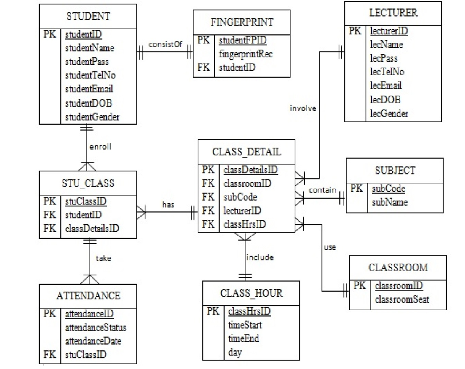

# University Academic & Attendance Management Database

A relational database implementation for managing university courses, class scheduling, student fingerprint records, and session attendance, developed using **Oracle APEX** (SQL).

### Project Overview
This project models an academic operations system designed to track student attendance across different class sessions and subjects. It covers the full lifecycle of physical database implementation, from defining constraints to creating aggregated analytical views.

### Key Highlights
* **Environment:** Oracle APEX (Workspace Environment)
* **Architecture:** Relational Database Management System (RDBMS)
* **Focus Areas:** Data Definition (DDL), Data Integrity (REGEX constraints), Data Manipulation (DML), and Reporting Views.

### Entity Relationship Diagram (ERD)
The system connects 9 operational entities, including `STUDENT`, `LECTURER`, `SUBJECT`, `CLASSROOM`, `CLASS_HOUR`, `CLASS_DETAIL`, `STU_CLASS`, `ATTENDANCE`, and `FINGERPRINT`.

### Technical Implementation
### 1. Data Integrity & Validation (DDL)
Tables use strong integrity rules via regular expressions (`REGEXP_LIKE`) and primary/foreign keys:
* **Student ID format:** `^S[0-9]{4}$` (e.g., `S0001`)
* **Lecturer ID format:** `^L[0-9]{4}$`
* **Email & Phone constraints:** Strict verification ensuring valid phone prefixes (`^08`) and email domains (`@gmail.com$`).
* **Foreign Key References:** Enforcing referential integrity across enrollment mappings (`STU_CLASS`) and dynamic attendance statuses.

### 2. Multi-Row Data Insertion (DML)
Populated dummy transaction data across all tables using Oracle's `INSERT ALL` syntax.

### 3. Aggregation & Analytical Views
Constructed consolidated SQL views using `INNER JOIN`, `UNION`, and `GROUP BY` to report summarized student attendance metrics.

### Contributors
* Aditya Naufal Erlangga
* Arya Raka Pratama
* Thio Michael Yulianto
* Andhika Hafizh Albana
* Samuel Prima Damanik
